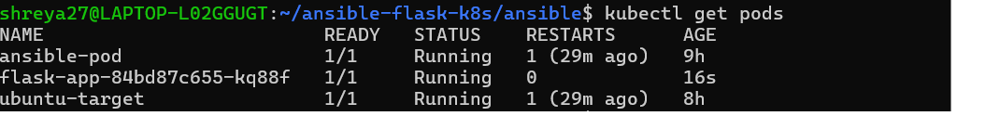
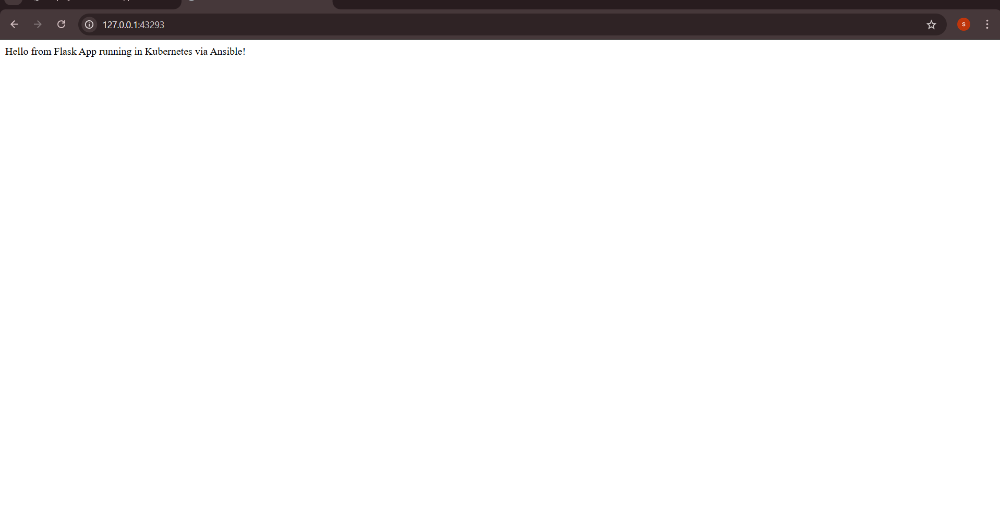

            Deploy a Dockerized Web App using Ansible Playbook on Kubernetes Cluster
This project demonstrates how to deploy a Dockerized Flask web application on a custom Kubernetes cluster using Ansible Playbooks. The control node is an Ansible pod running inside the cluster, and the target node is a separate Kubernetes pod where the web app gets deployed.

- Folder Structure

ansible-flask-k8s/
├── ansible/
│   ├── build_image.yml
│   ├── deploy_app.yml
│   └── inventory
├── flask-app/
│   ├── app.py
│   ├── Dockerfile
│   └── requirements.txt
├── k8s/
│   ├── flask-deployment.yml
│   └── flask-service.yml
└── README.md
  
  Project Overview

- Flask Web App
  A simple Python Flask application that returns a message.

  Dockerized using a custom Dockerfile.

  Exposed on port 5000.

- Ansible Setup
  Ansible control node runs inside a Kubernetes pod.

  Custom inventory targets another pod running Ubuntu.

  Automates image build and container deployment inside the cluster.

- Technologies Used
  Docker

  Kubernetes (Minikube)

  Ansible

  Python & Flask

  Kubectl

  YAML for K8s manifests

- Deployment Flow
  Flask app code is containerized using a Dockerfile.

  Kubernetes cluster is started via Minikube on WSL.

  Ansible pod is created to act as the control node.

  A separate Ubuntu pod is created to act as the target node.

  Ansible uses its inventory and playbooks to:

  Build the Docker image on the target node

  Deploy the container running Flask inside the pod

  Kubernetes deployment and service YAMLs manage the app.

- Screenshots
  Step	  Screenshot
  Pod Running in Kubernetes	
  Flask App UI Output	

- What I Learned
  Created a fully functional Ansible control node inside a Kubernetes pod.

  Automated Docker image builds and container deployment using Ansible.

  Understood how Kubernetes pods can serve as both control and target environments.

  Combined Ansible with Kubernetes to manage application deployment in a declarative and reproducible manner.

